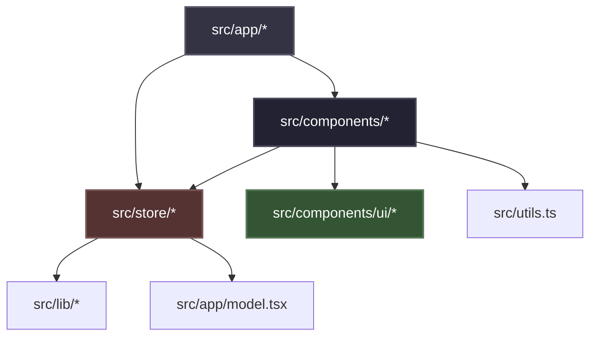

# Architecture Spine — hydra-explorer-frontend

## Design Paradigm

The frontend is built as a Client-Side Rendered (CSR) Next.js App Router application compiled for static export (`output: 'export'`). Global and local state is consolidated in a centralized Zustand store, replacing the nested context pattern. Components are structured around a clean hierarchy where UI presentation (shadcn/ui) is decoupled from state and asynchronous side effects.

### Dependency Direction Invariant



## Invariants & Rules

### AD-1 — Centralized Zustand State Management

- **Binds:** `src/providers/*`, `src/components/*`, `src/app/*`
- **Prevents:** Prop drilling and nested React Context pollution (avoiding the historical chain `IntervalSettingProvider → NetworkSettingProvider → HeadsDataProvider → CardanoExplorerProvider` which caused cascade re-renders).
- **Rule:** [ADOPTED] Global state (polling state, network parameters, data cache, search filter, page index) must be stored in a single unified Zustand store. Domain components must consume state by selecting slice selectors (`useStore(state => state.field)`) to prevent unnecessary re-renders.

### AD-2 — CSR Architecture with Shadcn/ui & Tailwind

- **Binds:** `src/components/ui/*`, `src/app/globals.css`, `next.config.mjs`
- **Prevents:** Inclusion of Server-Side Rendering (SSR) dependencies and layout drift.
- **Rule:** [ADOPTED] The app must be fully Client-Side Rendered (Next.js static export). All interactive UI components must be styled using Tailwind utility classes and based on the `shadcn/ui` base-nova token configurations. Standard HTML tags (``, `<a>`) must be replaced with `@/components/ui` or Next.js specialized components (`<Image>`, `<Link>`).

### AD-3 — Debounced URL Sync Invariant

- **Binds:** `src/hooks/useUrlSync.ts`, Zustand state modifiers
- **Prevents:** Next.js routing reconciliation lag during keystroke filters or state transition loops.
- **Rule:** [ADOPTED] On application mount, local state must sync-in once from `window.location.search`. State changes that update URL parameters (e.g. search query, status filters) must be debounced by `300ms` for text inputs and updated via `window.history.replaceState` or Next.js `router.replace(..., { scroll: false })` to avoid browser history congestion and layout scrolling reset.

### AD-4 — Connection Resilience & Adaptive Polling

- **Binds:** Polling hooks, API client
- **Prevents:** Continuous request flooding on offline state or backend server errors.
- **Rule:** [ADOPTED] The client must listen to browser `online`/`offline` window events. Polling must pause immediately when offline. On API fetch failure, polling intervals must scale via exponential backoff (e.g., doubling the wait time up to a maximum of 60 seconds) and display a warning toast using `sonner` / `shadcn` toast.

## Consistency Conventions

| Concern | Convention |
| --- | --- |
| **Naming Conventions** | Components must reside in camelCase folders with an `index.tsx` entry point (e.g., `src/components/HeadsTable/index.tsx`). Store files must be named `useStore.ts` or `store.ts`. |
| **Data & Formatting** | Centralize conversion of Lovelace to ADA via the `totalLovelaceValueLocked` helper in `src/utils.ts`. Do not write inline conversions in components. Return `0` if status is `Finalized` or `Aborted`. |
| **State & Cross-cutting** | Use `sonner` for system toasts (connection updates, load errors). Access configuration through `process.env.NEXT_PUBLIC_*` environment variables. |

## Stack

| Name | Version |
| --- | --- |
| Next.js | 16.2.10 |
| React | 19.2.7 |
| Tailwind CSS | 4.3.2 |
| shadcn/ui | 4.13.0 |
| pnpm | 11.10.0 |

## Structural Seed

```text
hydra-explorer/web/
  public/            # Static assets
  src/
    app/             # Next.js App Router root layout/page (Server Components acting as Shells)
    components/      # Domain-specific UI Components
      ui/            # Decoupled shadcn/ui presentation components
    hooks/           # Reusable hooks (URL sync, polling)
    lib/             # Utilities and API clients (axios/fetch configuration)
    store/           # Centralized Zustand store definitions
    utils.ts         # Centralized formatting and calculations
```

## Deferred

*   **Virtualization**: Infinite scrolling or virtualization of the Heads table is deferred until the standard pagination limit (default 100 items) is surpassed by active workloads.
*   **Theme Toggle**: Support for light mode is deferred; the app strictly adheres to a dark-mode palette using `bg-black`, `bg-gray-800` cards, and `text-white`.
*   **i18n Localization**: Multi-language support is deferred; UI strings are static.
